### Tugas 3
#### Langkah-langkah day3

1. Ketik di kolom pencarian 'composer', lalu pilih composer

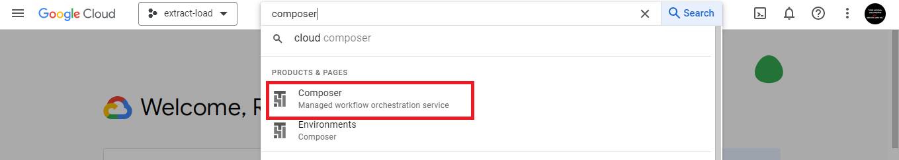

2. Jika belum enabled, pilih enable

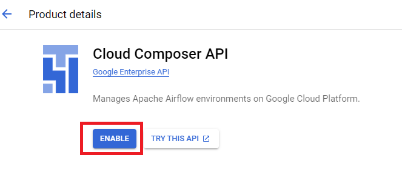

3. Create environment lalu pilih composer sesuai kebutuhan. Composer 1 menyediakan Airflow 1 dan 2, sedangkan Composer 2 hanya Airflow 2 namun bisa Autoscaling.
Disini saya menggunakan composer 2 sesuai demo mentor.

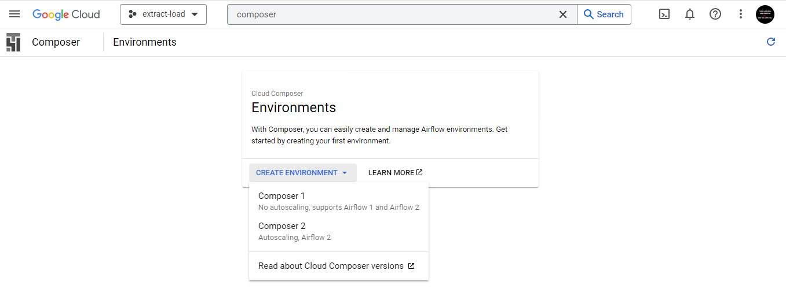

4. Input nama, pilih location, image version dan pilih default service account

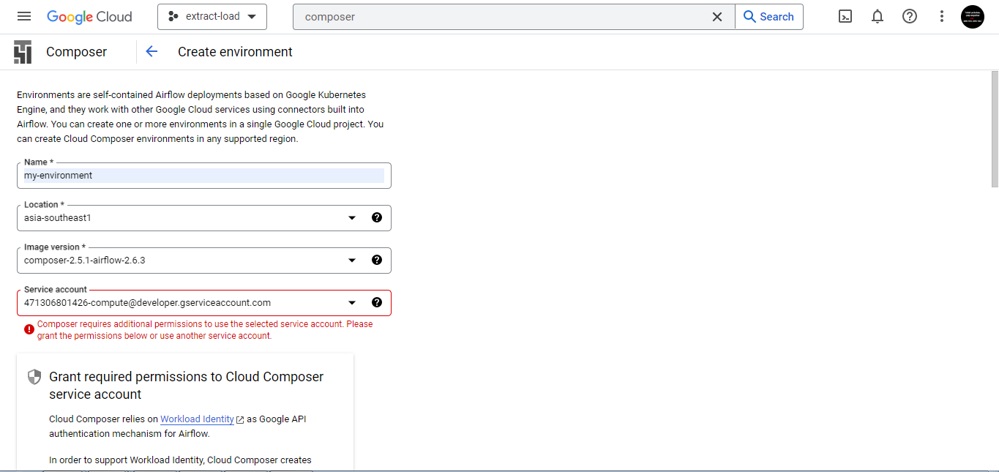

Jika meminta permissions, centang kotak kecil yang disediakan lalu grant

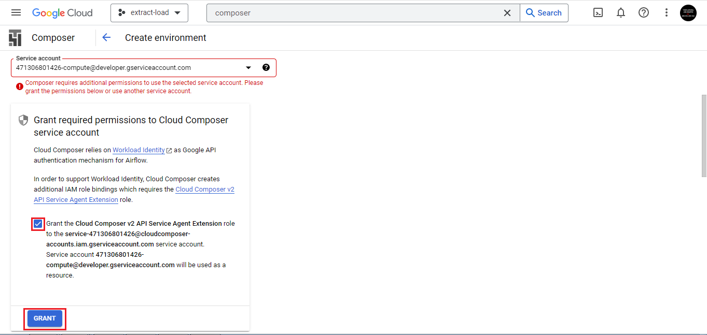

5. Klik create

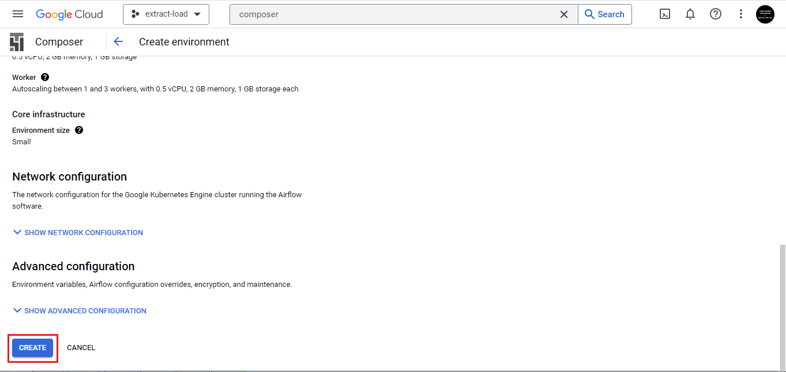

6. Tunggu hingga proses selesai

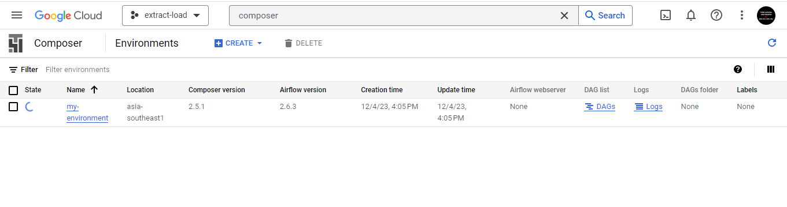

Setelah proses selesai, environment berhasil dibuat

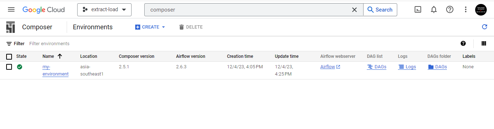

7. Upload DAG dengan nama ```insert_data_bigquery``` yang ada pada file [insert.py](../cloud-composer/insert.py) dengan menjalankan command berikut di terminal
```
gcloud composer environments storage dags import \
    --environment my-environment \
    --location asia-southeast1 \
    --source="cloud-composer/insert.py"
```

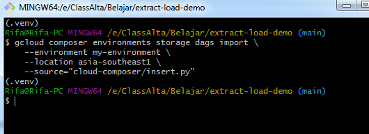

Before:
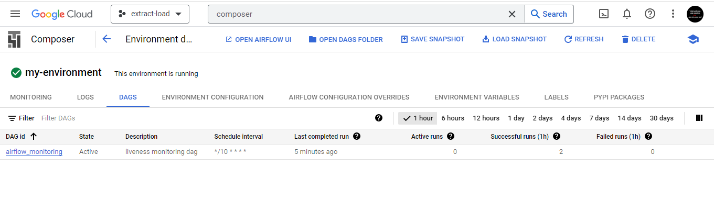

After:
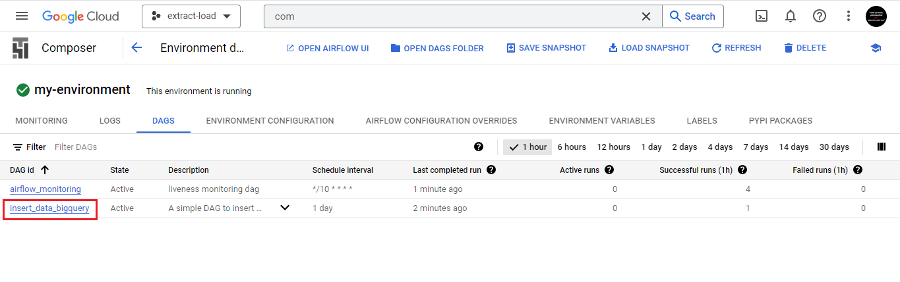

8. Cek ```my_dataset.my_table``` di BigQuery

Data sudah berhasil di insert ke my_table

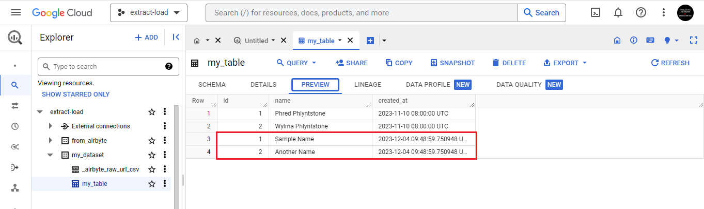

note: DAG yang sudah berhasil diupload bisa di trigger dan di pause secara manual 

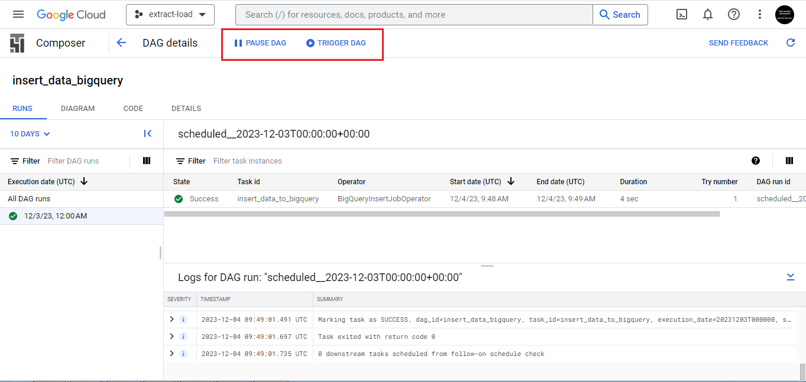

9. Delete DAG
```
gcloud composer environments storage dags delete \
    --environment my-environment \
    --location asia-southeast1 \
    cloud-composer/insert.py
```
pilih Y

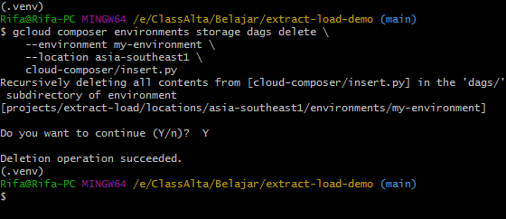

DAG berhasil dihapus

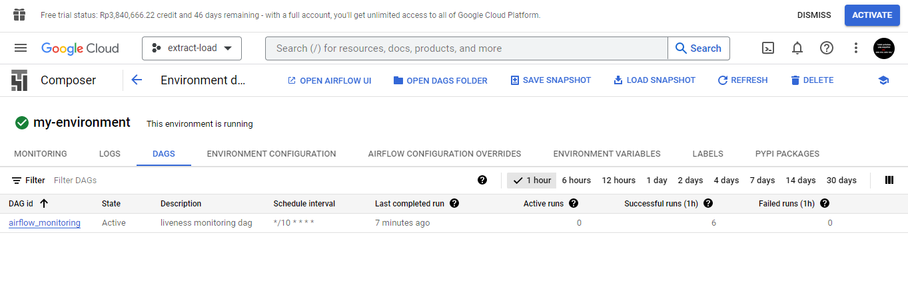
